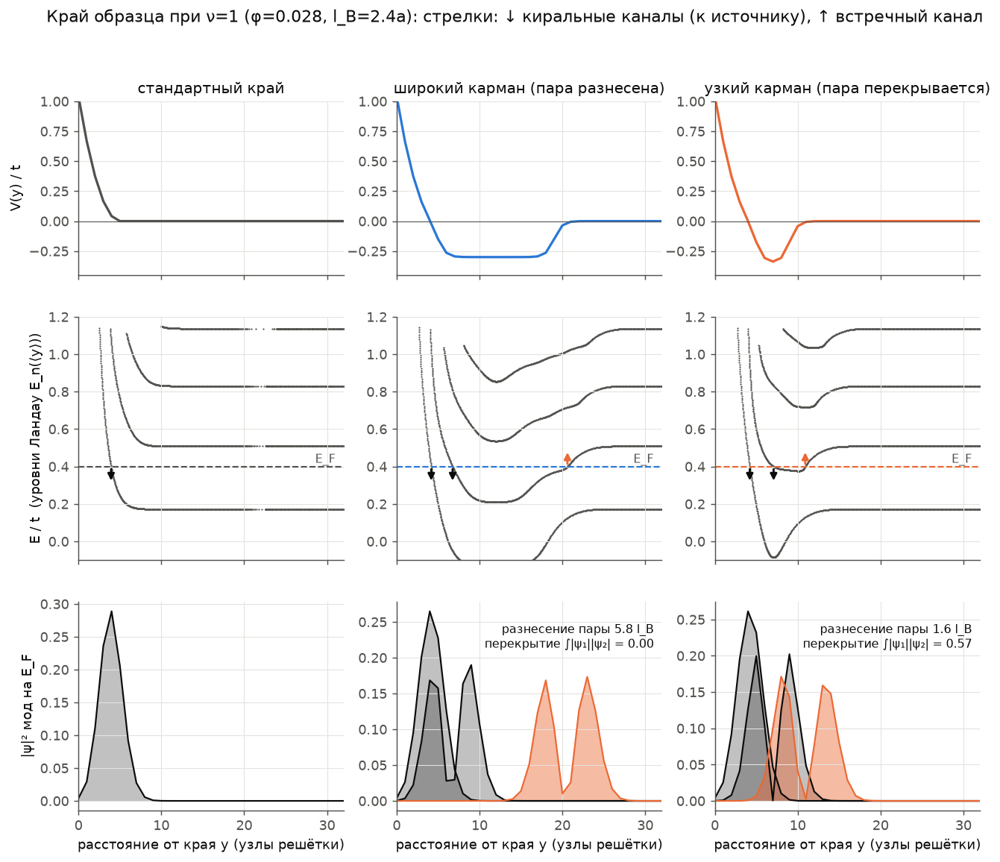
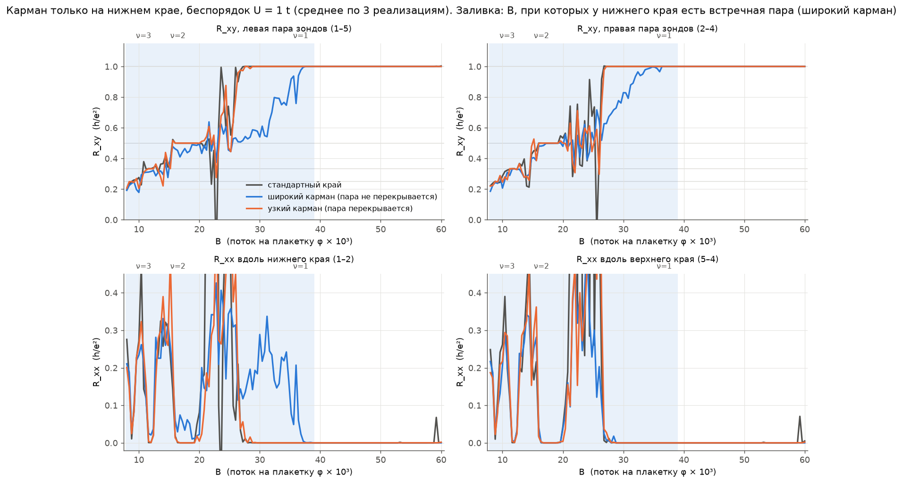
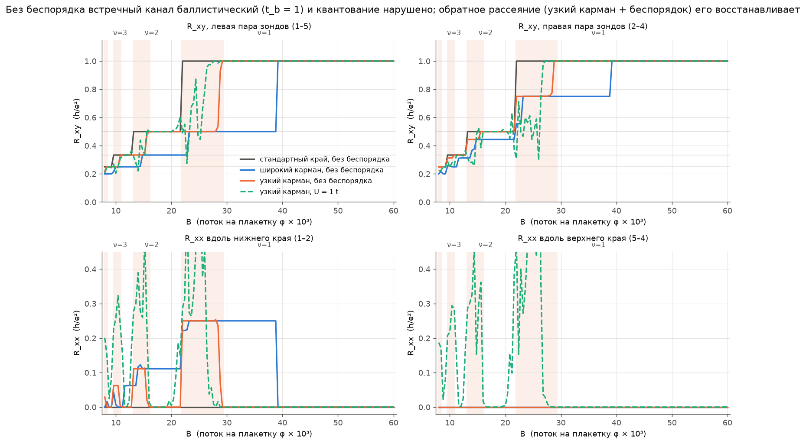
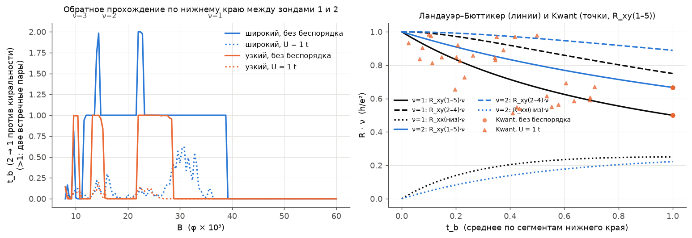
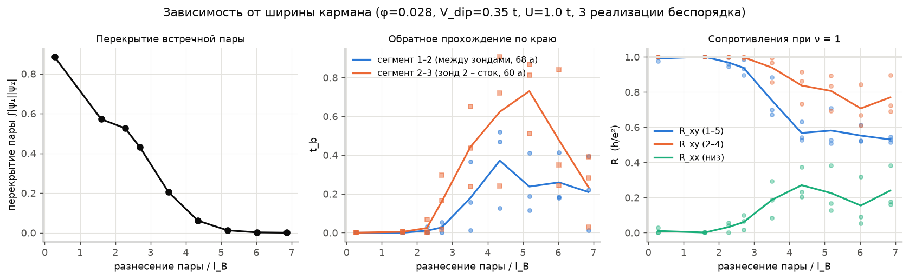
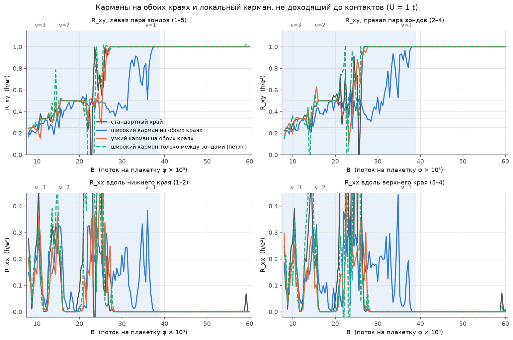
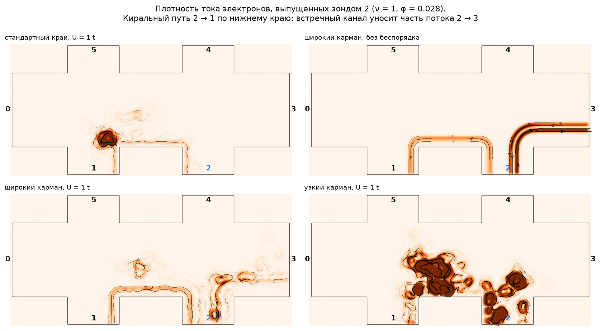

# КЭХ с «карманами» в удерживающем потенциале: влияет ли встречный краевой канал на холловский отклик?

Численный эксперимент (Kwant, модель сильной связи + формализм Ландауэра–Бюттикера)
для 6-терминального холловского мостика. Идея — качественно проверить сценарий,
в котором удерживающий потенциал у края сначала образует небольшую яму («карман»)
и только потом взмывает вверх. Резонатор не рассматривается.

> Статья arXiv:2511.04744 из контейнера, где делались расчёты, была недоступна
> (сетевой доступ к arxiv.org закрыт), поэтому модель края построена по описанию
> в постановке задачи, а не по формулам статьи.

## Модель

* Квадратная решётка, `a = 1`, `t = 1`, дно зоны `E = 0`, фаза Пайерлса,
  `φ` — поток на плакетку (в квантах `h/e`); `ħω_c ≈ 4πφ t`, `l_B = 1/√(2πφ)`.
  Энергия Ферми фиксирована, `E_F = 0.4 t`; поле развёртывается в диапазоне
  `φ = 0.008 … 0.06` (плато ν = 4 … 1, `l_B ≈ 1.6 … 4.5 a`).
* Мостик `300 × 80`, четыре зонда шириной 56 (много больше ширины кармана и `l_B`,
  как и в реальном образце), шесть идеальных омических контактов —
  полубесконечные подводы в том же поле, с тем же профилем края:

  ```
            5           4
            |           |
     0 ------------------------- 3        ток 0 → 3
            |           |
            1           2
  ```
  При нашем знаке `B` электроны обходят периметр как `0 → 5 → 4 → 3 → 2 → 1 → 0`
  (по верхнему краю слева направо, по нижнему — справа налево).
* Потенциал зависит от расстояния `d` до границы образца:
  `V(d) = V_wall·((d0−d)/d0)²·θ(d0−d) − V_dip·window(d; d_in, d_out)`
  (`V_wall = 1.5`, `d0 = 6`). Второе слагаемое — карман шириной `d_out − d_in`
  непосредственно перед стенкой.
  * **широкий карман**: `V_dip = 0.3`, ширина 14 → встречная пара разнесена на ≈ 5.8 `l_B` (при ν = 1, `φ = 0.028`), перекрытие < 0.01;
  * **узкий карман**: `V_dip = 0.35`, ширина 4 → пара разнесена на ≈ 1.6 `l_B`, перекрытие ≈ 0.57.
* Беспорядок Андерсона `U = 1 t` (равномерно в `[−U/2, U/2]`) во всей
  рассеивающей области; «чистые» расчёты — с `U = 0`.
* Варианты расположения кармана: только на нижнем крае (включая нижние зонды и
  нижние половины подводов 0 и 3), на обоих краях, и **локальный** карман на
  нижнем крае только между зондами 1 и 2, не доходящий ни до одного контакта.

## Откуда берётся встречный канал



Уровни Ландау повторяют ход потенциала: `E_n(y) ≈ ħω_c(n+½) + V(y)`. Если в
объёме `E_F` лежит между уровнями `n` и `n+1`, но в кармане уровень `n+1`
опускается ниже `E_F`, то он пересекает `E_F` дважды. Внешнее пересечение даёт
ещё один канал, сонаправленный с киральным, а внутреннее, где `dV/dy` другого
знака, даёт **встречный** канал. Это случается на «низкополевом» краю каждого
плато, пока `(n+1+½)ħω_c − V_dip,eff < E_F`. Узкий карман даёт пару на расстоянии
порядка `l_B` (волновые функции перекрываются), широкий — разнесённую пару.

## Общее утверждение (Ландауэр–Бюттикер)

Пусть край между двумя соседними контактами содержит ν киральных каналов и
встречную пару, а внутри сегмента происходит что угодно: упругое обратное
рассеяние, перемешивание каналов, частичная равновесность. Из сохранения тока
следует `T_вперёд − T_назад = ν`, поэтому сегмент полностью описывается одним
числом — вероятностью **обратного прохождения** `t_b ∈ [0, 1]`, то есть
вероятностью того, что электрон, выпущенный «нижним по течению» контактом,
дойдёт против киральности до «верхнего». Для кармана на нижнем крае с одинаковым
`t_b` на всех сегментах (`lb.py`, символьное решение):

| величина | формула (в `h/e²`) | ν=1, `t_b=1` |
|---|---|---|
| `R_xy` (зонды 1–5) | `1/(ν + t_b)` | 1/2 |
| `R_xy` (зонды 2–4) | `(ν + 2t_b)/(ν + t_b)²` | 3/4 |
| `R_xx` вдоль нижнего края | `t_b/(ν + t_b)²` | 1/4 |
| `R_xx` вдоль верхнего края | `0` | 0 |
| двухтерминальное | `(ν² + 3νt_b + 3t_b²)/(ν + t_b)³` | 7/8 |

Из формул видно:

* **портит квантование не обратное рассеяние, а его отсутствие.** Если пара
  баллистическая (`t_b = 1`), встречный канал переносит потенциал контакта,
  стоящего ниже по течению, назад к контакту выше по течению. Это и сдвигает
  `R_xy`, и даёт `R_xx ≠ 0`, хотя диссипации в объёме нет, а объёмная
  σ_xy = ν e²/h остаётся топологической;
* **обратное рассеяние внутри пары лечит.** Когда пара перекрывается и
  беспорядок рассеивает электроны назад, встречный канал локализуется вдоль
  края, `t_b ~ exp(−L/ξ) → 0`, и квантование `R_xy = h/νe²`, `R_xx = 0`
  восстанавливается;
* **отклонение возможно только там, где пара доходит до контактов.** Если
  карман локальный и не касается омических контактов, пара образует замкнутую
  петлю, `t_b ≡ 0`, и никакого эффекта в DC-транспорте нет;
* край без кармана остаётся идеальным (`R_xx(верх) = 0`), а разность двух
  холловских напряжений ровно равна `R_xx` дефектного края.

## Результаты

### 1. Стандартный образец и карман на одном (нижнем) крае



Серые кривые — стандартный образец: плато `R_xy = h/νe²` и `R_xx = 0` на плато,
между плато типичные для малого когерентного образца мезоскопические
флуктуации. Кривые на этом рисунке усреднены по трём реализациям беспорядка
`U = 1 t`.

* **Широкий карман (пара разнесена на 4–6 `l_B`, не перекрывается):** на
  низкополевой части плато ν = 1 (`φ ≈ 0.027–0.038`) `R_xy(1–5)` опускается до
  ≈ 0.53 `h/e²`, `R_xy(2–4)` — до ≈ 0.67 `h/e²`. Вдоль нижнего края `R_xx`
  доходит до ≈ 0.34 `h/e²`, вдоль верхнего края `R_xx = 0` (с точностью 10⁻⁴
  при `φ > 0.03`). Слабее то же видно и на плато ν = 2. При `φ > 0.039` пары
  нет, и кривые совпадают с эталоном.
* **Узкий карман (пара на расстоянии ≈ 1.6 `l_B`, перекрытие ≈ 0.6):** пара
  существует при `φ ≈ 0.022–0.029` (рис. 1 и 3), то есть частично внутри
  перехода 2 → 1. На участке плато `φ ≈ 0.0275–0.029` беспорядок возвращает
  `R_xy` к `h/e²` с точностью ≈ 0.01, тогда как без беспорядка там же
  `R_xy(1–5) = 0.5` (рис. 3). Выше по полю кривые совпадают с эталоном до 10⁻³.
  Чистое сравнение «перекрыты / не перекрыты» при одном и том же поле внутри
  плато приведено в разделе 3.

Заливка на рисунке отмечает поля, при которых в широком кармане есть хотя бы одна
встречная пара (на плато ν = 2, 3 их может быть и две).

### 2. Без беспорядка и с беспорядком



Без беспорядка встречный канал баллистический, `t_b = 1`, и Kwant **точно**
воспроизводит формулы из таблицы выше:
`R_xy(1–5) = 1/(ν+1)` (0.5; 0.333; 0.25 при ν = 1, 2, 3),
`R_xy(2–4) = (ν+2)/(ν+1)²` (0.75; 0.444; 0.3125),
`R_xx(низ) = 1/(ν+1)²` (0.25; 0.111; 0.0625) на всём интервале полей, где есть
пара. Это верно **и для узкого кармана**: сама по себе встречная пара, даже
перекрытая, в отсутствие рассеивателей даёт максимальное отклонение. Если
включить беспорядок в узком кармане (зелёный пунктир), вернётся точное
квантование.



Слева — `t_b` между зондами 1 и 2, извлечённое прямо из матрицы рассеяния
Kwant. Справа — формулы Ландауэра–Бюттикера и точки Kwant на плато.
В широком кармане с беспорядком часть встречного потока проходит мимо зонда
(например, прохождение 0 → 2 в обход зонда 1 ≈ 0.1), поэтому формула с одним
`t_b` там приближённая. Все кривые на рисунках посчитаны по полной матрице
прохождений Kwant, а не по этой формуле.

### 3. Перекрываются ли партнёры: зависимость от ширины кармана



Фиксированное поле (ν = 1), глубина кармана `0.35 t`, `U = 1 t`, три реализации
беспорядка; меняется только ширина кармана, то есть расстояние между
встречными каналами.

| разнесение пары | ≤ 2.3 `l_B` | 2.7 `l_B` | 3.5 `l_B` | ≥ 4.3 `l_B` |
|---|---|---|---|---|
| перекрытие `∫|ψ₁||ψ₂|` | 0.9 – 0.5 | 0.43 | 0.20 | ≤ 0.06 |
| `t_b` (сегмент 1–2) | ≈ 0 – 0.01 | 0.03 | 0.18 | 0.2 – 0.4 |
| `R_xy(1–5)`, `h/e²` | 0.97 – 1.00 | 0.94 | 0.75 | 0.53 – 0.58 |
| `R_xx(низ)`, `h/e²` | ≤ 0.03 | 0.06 | 0.19 | 0.15 – 0.27 |

Пока партнёры перекрываются, беспорядок рассеивает электроны внутри пары
назад, встречный канал локализуется на длине, меньшей расстояния между
контактами, и отклик квантован. Когда партнёры разнесены, обратного рассеяния
нет, встречный канал доходит до контакта, и квантование нарушается.

### 4. Карманы на обоих краях и локальный карман



* Широкие карманы на обоих краях: отклонения складываются. При баллистической
  паре Ландауэр–Бюттикер даёт `R_xy = 1/3`, `R_xx = 2/9` при ν = 1 на обоих
  краях; Kwant с беспорядком — `R_xy ≈ 0.33–0.4`.
* Узкие карманы на обоих краях с беспорядком: квантование сохраняется
  (`|R_xy − h/e²| ≤ 3·10⁻³` на плато ν = 1, одна реализация беспорядка).
* Широкий карман только на участке нижнего края между зондами 1 и 2, не
  доходящий ни до одного контакта: пара замкнута в петлю, `t_b ≡ 0`, и кривые
  совпадают с эталоном — хотя обратного рассеяния внутри петли нет.

### 5. Где течёт ток



Плотность тока электронов, выпущенных зондом 2; цветовая шкала общая и
обрезана сверху, поэтому сильные локальные кольцевые токи вокруг резонансов
беспорядка выглядят насыщенными.

* Эталон: весь ток идёт по киральному пути 2 → 1.
* Широкий карман без беспорядка: виден второй путь. Встречный канал на
  внутренней границе кармана уносит часть потока из зонда 2 вправо к стоку 3,
  то есть против киральности. Поскольку пара доходит и до зонда 1, по
  сегменту 1–2 тоже идут два канала.
* Широкий карман с беспорядком: встречный путь к стоку 3 сохраняется, хотя
  и ослаблен.
* Узкий карман с беспорядком: у края остаются только локализованные
  кольцевые токи вокруг резонансов, и встречный путь к стоку 3 не доходит.

## Вывод

1. Встречный партнёр киральному каналу действительно появляется, если у края
   есть карман глубиной порядка расстояния от `E_F` до следующего уровня
   Ландау. Это происходит на низкополевой стороне каждого плато.
2. Интуиция «обратное рассеяние на одном крае не должно портить холловский
   отклик» верна, и даже в более сильной форме: **обратное рассеяние внутри
   края не может нарушить квантование**, оно его, наоборот, защищает. Всё, что
   происходит внутри края между двумя контактами, сводится к одному числу
   `t_b`, а квантование нарушается только при `t_b ≠ 0`.
3. Отклонения `R_xy` от `h/νe²` и `R_xx ≠ 0` появляются, когда встречный
   канал **не** рассеивается назад (партнёры не перекрываются) **и** доходит до
   омических контактов. Тогда контакт, стоящий ниже по течению, «подсвечивает»
   своим потенциалом контакт выше по течению. Объёмная σ_xy при этом остаётся
   ν e²/h — это эффект контактов и геометрии, а не разрушение топологии.
4. Экспериментальные признаки такого сценария:
   * `R_xx ≠ 0` только вдоль края с карманом;
   * холловские напряжения на разных парах зондов различаются ровно на `R_xx`
     этого края;
   * эффект сосредоточен на низкополевой стороне плато и исчезает, если
     карман не доходит до контактов.

## Ограничения

* Модель одночастичная и когерентная: нет электрон-электронного
  взаимодействия, реконструкции края и неупругой релаксации (эквилибрации)
  между каналами. Неупругая эквилибрация на длинах, больших длины
  эквилибрации, тоже приводит к `t_b → 0`, как в ν = 2/3.
* Образец мезоскопический (`L ≈ 125 l_B`); переходы между плато поэтому
  сильно флуктуируют. Основные кривые (эталон, широкий и узкий карман на одном
  крае) усреднены по трём реализациям беспорядка, остальные — одна реализация.
* Параметры кармана выбраны для наглядности, а не подогнаны под конкретный
  эксперимент.


## Файлы

* `model.py` — геометрия, потенциал, калибровка поля, расчёт `R_xy`, `R_xx`.
* `lb.py` — аналитическая модель Ландауэра–Бюттикера с одним параметром `t_b`.
* `edge_modes.py` — лента: уровни Ландау `E_n(⟨y⟩)`, моды на `E_F`, перекрытие пары.
* `run_sweeps.py` — развёртки по `B` для всех конфигураций → `data/*.npz`.
* `width_sweep.py` — зависимость от ширины кармана (перекрытия пары) → `data/width_sweep.npz`.
* `plots.py` — все рисунки → `figs/`.

Запуск (нужен Kwant ≥ 1.4):

```bash
pip install kwant matplotlib scipy
OMP_NUM_THREADS=1 python run_sweeps.py   # ~1 ч на 4 ядрах (15 развёрток)
OMP_NUM_THREADS=1 python width_sweep.py  # ~20 мин
python plots.py
```

Замечание о калибровке: `kwant.physics.magnetic_gauge` в данной версии
требует `B = 2φ`, чтобы получить φ квантов потока на плакетку. Это проверено
по расстоянию между уровнями Ландау в ленте в калибровке Ландау
(`ħω_c = 4πφ`) и по положению плато.
